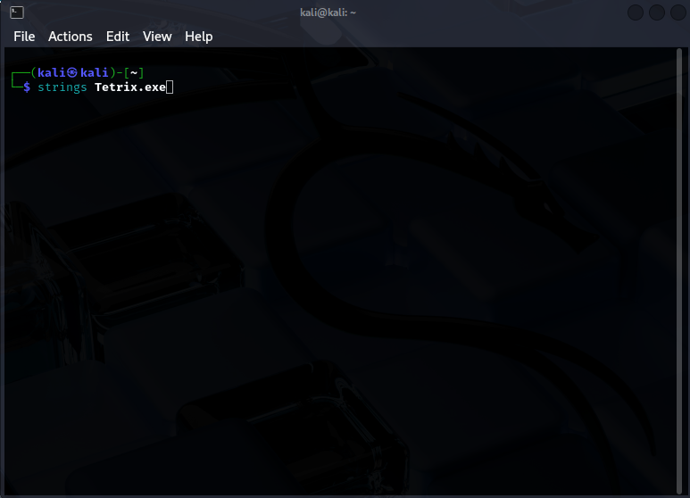
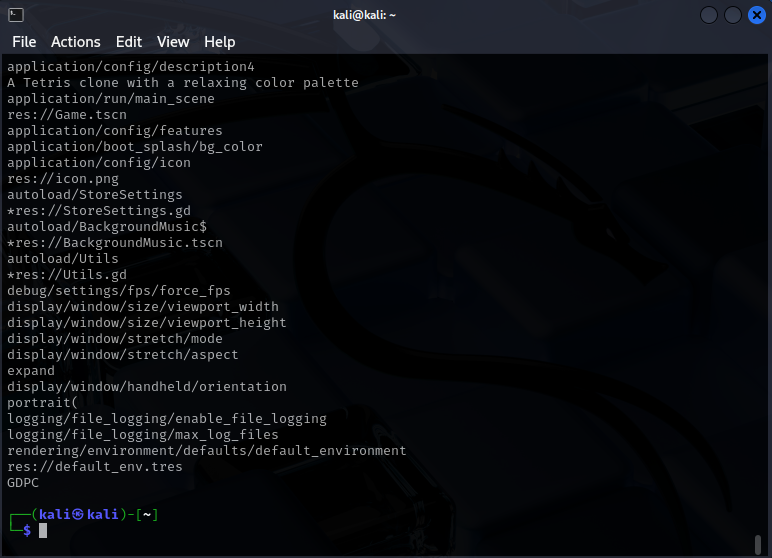

# TryHackMe - The Game

You can find this room [here](https://tryhackme.com/room/hfb1thegame).


## Looking for the flag

The room is rated as "Easy", so it shouldn't require too much effort. There is a file to download, which includes a ```.exe``` file. Although it was compiled for Windows, I want to analyze it using the ```strings``` command on my Kali system.



Here is the result:



There are many strings in the file, but I know that the one I'm looking for starts with *THM{*. So, I can filter the result using ```grep```:


And I get the flag!


This room was indeed easy, and the flag can be captured in just a few minutes.
